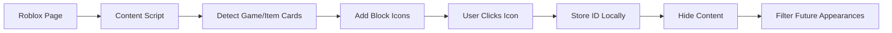
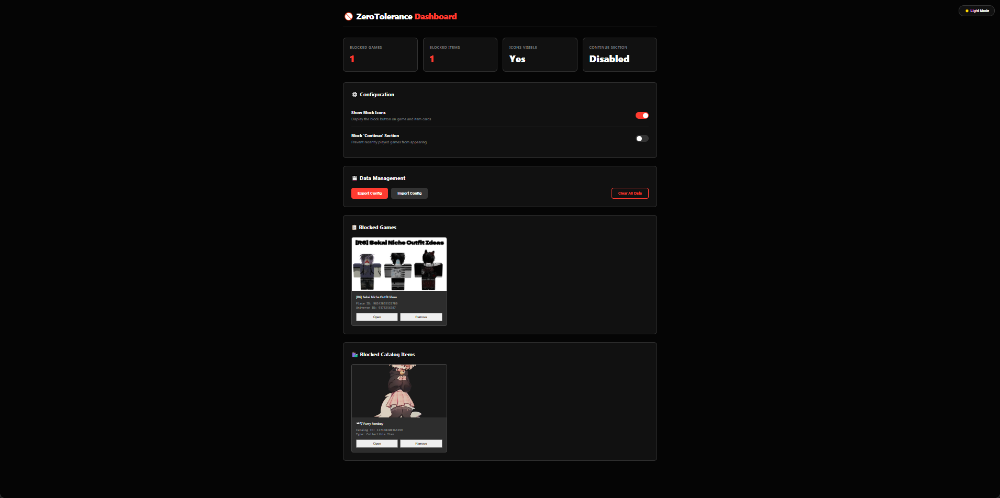
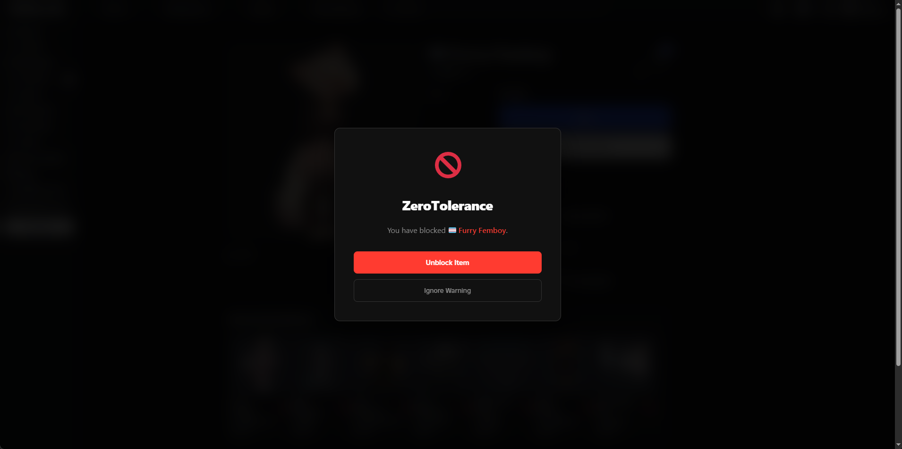

<div align="center">

# 🚫 ZeroTolerance Blocker


**Zero Tolerance for inappropriate games and items on Roblox**

[](LICENSE)

**A powerful browser extension that gives you complete control over your Roblox experience. Block unwanted games and catalog items with precision and style.**

</div>

---

## ✨ Features

<div align="center">

| Feature | Description |
|---------|-------------|
| 🎮 **Game Blocking** | Block games from recommendations and continue sections |
| 🛍️ **Catalog Item Blocking** | Block unwanted catalog items from appearing |
| ⛔ **Visual Block Icons** | Clean, unobtrusive block buttons on game and item cards |
| 🎯 **Smart Detection** | Automatically detects and blocks across all Roblox pages |
| 💾 **Local Storage** | 100% local - all data stays on your device |
| 🔄 **Auto-Hide** | Blocked content disappears instantly |
| 📊 **Dashboard Interface** | Modern dark-themed control panel |
| 💾 **Export/Import** | Backup and restore your blocklist |
| 🌓 **Theme Support** | Beautiful dark mode interface |
| 🔒 **Privacy First** | No external servers, no data collection |

</div>

---

## 🎨 Design Philosophy

**ZeroTolerance Blocker** features a modern, security-focused design:

- **Dark Theme**: Professional black interface with red accents
- **Minimalist UI**: Clean, uncluttered interface
- **Fast Performance**: Lightweight and responsive
- **User Control**: Complete transparency and control over your data

---

## 📦 Installation

### Chrome/Edge (Chromium-based browsers)

<details>
<summary><b>Step-by-step guide</b> (Click to expand)</summary>

1. **Download the extension**

2. **Open Extensions Page**
   - Chrome: Navigate to `chrome://extensions/`
   - Edge: Navigate to `edge://extensions/`

3. **Enable Developer Mode**
   - Toggle the "Developer mode" switch in the top right corner

4. **Load the Extension**
   - Click "Load unpacked"
   - Select the `chrome-mv3` folder
   - The extension icon should appear in your toolbar! 🎉

</details>

### Firefox

<details>
<summary><b>Step-by-step guide</b> (Click to expand)</summary>

1. **Download the extension**

2. **Open Firefox Debugging Page**
   - Navigate to `about:debugging`
   - Click "This Firefox"

3. **Load the Extension**
   - Click "Load Temporary Add-on"
   - Navigate to the `firefox` folder
   - Select the `manifest.json` file
   - The extension should now be active! 🎉

</details>

> **✅ Compatibility**: Both Chrome/Edge and Firefox variants are fully tested and supported. The extension uses browser-agnostic APIs for maximum compatibility.

---

## 🚀 Usage

### Quick Start

1. **Navigate to Roblox**
   - Go to [Roblox.com](https://www.roblox.com) and log in
   - Visit any page (home, catalog, games, etc.)

2. **Block Content**
   - Look for the 🚫 block icon on game cards or catalog items
   - Click the icon to instantly block
   - The content will fade out and disappear

3. **Manage Your Blocks**
   - Click the extension icon to open the dashboard
   - View statistics and manage your blocklist
   - Export or import your settings

### Extension Popup

The popup provides quick access to:

- **Statistics**: See how many games and items you've blocked
- **Toggle Controls**: Enable/disable block icons and continue section blocking
- **Quick Actions**: View blocked content, export/import settings
- **Settings Link**: Access the full dashboard

### Full Settings Dashboard

Access the complete dashboard by:

1. Clicking "Open Full Settings Dashboard" in the popup, or
2. Right-clicking the extension icon → Options

**Dashboard Features:**

- **Statistics Overview**: Visual cards showing blocked counts
- **Configuration Panel**: Toggle all settings
- **Data Management**: Export, import, or clear all data
- **Blocked Games Browser**: View and manage all blocked games with thumbnails
- **Blocked Items Browser**: View and manage all blocked catalog items
- **Theme Toggle**: Switch between light and dark modes

### Advanced Features

#### Block Games

- **From Recommendations**: Click the block icon on any recommended game
- **From Continue Section**: Enable "Continue Section" toggle to block recently played games
- **Direct Game Pages**: Blocked games show a warning overlay when accessed directly

#### Block Catalog Items

- **From Catalog Pages**: Click the block icon on any catalog item
- **Direct Item Pages**: Blocked items show a warning overlay when accessed directly
- **Item Information**: View item name, type, and catalog ID in the dashboard

#### Export/Import Blocklist

**Export:**
1. Open the popup or dashboard
2. Click "Export" or "Export Config"
3. A JSON file will download with all your blocked games and items

**Import:**
1. Click "Import" or "Import Config"
2. Choose your exported JSON file
3. Select mode:
   - **Replace**: Overwrites all existing blocks
   - **Merge**: Adds to existing blocks (removes duplicates)

#### View & Manage Blocked Content

**In Popup:**
- Click "Manage Blocked Games" or "Manage Blocked Items"
- View all blocked content in a modal
- Click any item to open it in a new tab
- Click "Remove" to unblock

**In Dashboard:**
- Scroll to the "Blocked Games" or "Blocked Catalog Items" sections
- View content in a grid layout with thumbnails (games only)
- Use "Open" to view the content
- Use "Remove" to unblock

---

## 🔧 How It Works



### Technical Architecture

- **Content Script**: Runs on all `roblox.com` pages
- **Smart Detection**: Multiple strategies to identify games and catalog items
- **Local Storage**: All data stored in browser storage API
- **Dynamic Updates**: MutationObserver watches for new content
- **API Integration**: Fetches game/item names and thumbnails via Roblox APIs
- **CORS Proxy**: Background service worker handles API requests
- **State Management**: All settings persist across sessions

### Data Storage

The extension stores:

- **Blocked Games**: Array of `{placeId, name, universeId}`
- **Blocked Catalog Items**: Array of `{catalogId, name, type}`
- **Settings**: Toggle states, theme preference
- **Format**: JSON stored in browser's local storage

---

## 🔒 Privacy & Security

<div align="center">

| Aspect | Details |
|--------|---------|
| **Data Storage** | 100% local - stored in your browser only |
| **Network Activity** | Only to Roblox APIs for fetching game/item info |
| **Permissions** | `storage`, `tabs`, and host permissions for Roblox APIs |
| **Scope** | Only runs on `roblox.com` domains |
| **Open Source** | Full code transparency - inspect everything |
| **No Tracking** | Zero analytics, zero telemetry, zero external requests |

</div>

✅ **Your privacy is protected** - All blocked IDs and settings are stored locally and never leave your device. The extension only makes requests to Roblox's official APIs to fetch game/item information.

---

## 🎨 Screenshots

<div align="center">

### Extension Popup

*Modern dark-themed popup with statistics and quick controls*

### Settings Dashboard

*Full-featured dashboard with grid layout and comprehensive management tools*

### Block Overlay

*Warning overlay when accessing blocked games or items directly*

</div>

---

## 🐛 Troubleshooting

<details>
<summary><b>Common Issues & Solutions</b> (Click to expand)</summary>

### Block Icons Don't Appear

1. **Refresh the page**
   - The extension needs the page to fully load
   - Press `F5` or `Ctrl+R` to refresh

2. **Check Extension Status**
   - Go to `chrome://extensions/` (Chrome) or `about:debugging` (Firefox)
   - Ensure the extension is enabled
   - Check for any error messages

3. **Verify Settings**
   - Open the extension popup
   - Ensure "Show Block Icons" toggle is enabled
   - Refresh the page after changing settings

4. **Check Browser Console**
   - Press `F12` to open Developer Tools
   - Look for messages starting with `[Roblox Blocker]`
   - Check for any JavaScript errors

### Blocked Content Still Appears

- **Clear browser cache** and refresh
- **Verify the extension is enabled**
- **Check if you're on the correct Roblox page**
- **Ensure the content script is running** (check console for logs)

### Import/Export Issues

- **Verify JSON format** - ensure the file is valid JSON
- **Check file size** - very large blocklists may take time to process
- **Try exporting first** to see the expected format

### Theme Not Applying

- **Refresh the page** after changing theme
- **Check browser compatibility** - ensure you're using a supported browser
- **Clear extension storage** if theme persists incorrectly

### API Errors

- **Check internet connection** - the extension needs to fetch game/item info
- **Roblox API may be down** - wait and try again
- **CORS issues** - ensure the background service worker is running

</details>

---

## 🛠️ Development

### Project Structure

```
roblox-recommendation-block/
├── chrome-mv3/              # Chrome/Edge extension (Manifest V3)
│   ├── manifest.json
│   ├── content.js           # Main content script
│   ├── popup.html           # Extension popup UI
│   ├── popup.js             # Popup logic
│   ├── options.html         # Full settings dashboard
│   ├── options.js            # Dashboard logic
│   ├── background.js        # Service worker (CORS proxy)
│   ├── styles.css           # Content script styles
│   ├── icon16.png
│   ├── icon48.png
│   └── icon128.png
├── firefox/                 # Firefox extension (Manifest V3)
│   ├── manifest.json
│   ├── content.js
│   ├── popup.html
│   ├── popup.js
│   ├── options.html
│   ├── options.js
│   ├── background.js
│   ├── styles.css
│   └── icons...
└── README.md
```

### Building from Source

1. **Clone the repository**

2. **Choose your browser variant:**
   - **Chrome/Edge**: Load the `chrome-mv3` folder
   - **Firefox**: Load the `firefox` folder

g. **Load as unpacked extension**
   - Follow the installation instructions above
   - Make changes and reload the extension

### Debugging

Open the browser console (F12) on any Roblox page. The extension logs detailed information:

- `[Roblox Blocker]` - General logs
- `[Roblox Blocker] Error` - Error messages
- `[Roblox Blocker] Found X games` - Detection logs

**Console Commands:**

```javascript
// Check extension state
chrome.storage.local.get(null, console.log)  // Chrome
browser.storage.local.get(null, console.log)  // Firefox
```

---

## 📝 Changelog

### Version 1.0.0

- ✨ Complete UI redesign with ZeroTolerance branding
- 🎮 Game blocking functionality
- 🛍️ Catalog item blocking
- 📊 Modern dashboard interface
- 💾 Export/Import blocklist
- 🌓 Dark theme support
- 🔄 Auto-hide blocked content
- ⚙️ Continue section blocking
- 🎯 Smart content detection
- 🔒 Privacy-first architecture

---

## 📝 License

This project is licensed under the **MIT License** - see the [LICENSE](LICENSE) file for details.

---

## 🤝 Contributing

Contributions are welcome! Please feel free to submit a Pull Request.

1. Fork the repository
2. Create your feature branch (`git checkout -b feature/AmazingFeature`)
3. Commit your changes (`git commit -m 'Add some AmazingFeature'`)
4. Push to the branch (`git push origin feature/AmazingFeature`)
5. Open a Pull Request

**Guidelines:**
- Follow the existing code style
- Test on both Chrome and Firefox
- Update documentation as needed
- Ensure privacy and security standards

---

## ⭐ Show Your Support

If you find ZeroTolerance Blocker useful, please consider:

- ⭐ **Starring** this repository
- 🐛 **Reporting** bugs or issues
- 💡 **Suggesting** new features
- 📢 **Sharing** with friends and the community
- 📝 **Contributing** code or documentation

---

## 🎯 Roadmap

Future enhancements may include:

- 🔍 Advanced filtering options
- 📈 Blocking statistics and analytics
- 🎨 Custom theme options
- 🔔 Notification preferences
- 📱 Mobile browser support (if possible)
- 🌐 Multi-language support

---

<div align="center">

**🚫 ZeroTolerance Blocker - Zero Tolerance for inappropriate content**

**Made with ❤️ for the Roblox community**

[Report Bug](https://github.com/mireyacs/roblox-recommendation-block/issues) · [Request Feature](https://github.com/mireyacs/roblox-recommendation-block/issues) · [View Documentation](https://github.com/mireyacs/roblox-recommendation-block#readme)

</div>
