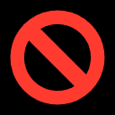
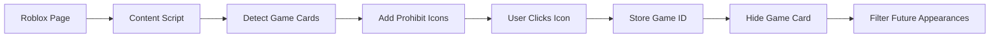
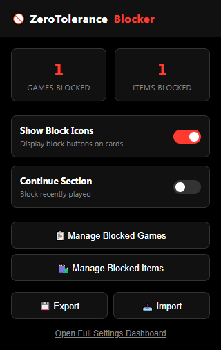
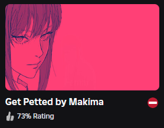

<div align="center">

# 🚫 Roblox Recommendation Blocker



**Block unwanted games from your Roblox recommendations with a single click!**

<!-- [](https://chrome.google.com/webstore) -->
<!-- [](https://microsoftedge.microsoft.com/addons) -->
[](LICENSE)

</div>

---

## ✨ Features

<div align="center">

| Feature | Description |
|---------|-------------|
| ⛔ **Prohibit Icons** | Clean, unobtrusive icons on each game card |
| 🚫 **One-Click Blocking** | Block games instantly with a single click |
| 💾 **Local Storage** | All data stored locally in your browser |
| 🔄 **Auto-Hide** | Blocked games automatically disappear |
| 🎛️ **Toggle Control** | Show/hide icons via extension popup |
| 🎯 **Targeted Sections** | Focus on Recommended For You section |
| ⚙️ **Optional Continue** | Optional support for Continue section |

</div>

---

## 📦 Installation

### Chrome/Edge (Chromium-based browsers)

<details>
<summary><b>Step-by-step guide</b> (Click to expand)</summary>

1. **Download the extension**
   ```bash
   git clone https://github.com/mireyacs/roblox-recommendation-block.git
   cd roblox-recommendation-block
   ```

2. **Open Extensions Page**
   - Chrome: Navigate to `chrome://extensions/`
   - Edge: Navigate to `edge://extensions/`

3. **Enable Developer Mode**
   - Toggle the "Developer mode" switch in the top right corner

4. **Load the Extension**
   - Click "Load unpacked"
   - Select the `chrome-mv3` folder
   - The extension icon should appear in your toolbar! 🎉

</details>

### Firefox

<details>
<summary><b>Step-by-step guide</b> (Click to expand)</summary>

1. **Download the extension**
   ```bash
   git clone https://github.com/mireyacs/roblox-recommendation-block.git
   cd roblox-recommendation-block
   ```

2. **Open Firefox Debugging Page**
   - Navigate to `about:debugging`
   - Click "This Firefox"

3. **Load the Extension**
   - Click "Load Temporary Add-on"
   - Navigate to the `firefox` folder
   - Select the `manifest.json` file
   - The extension should now be active! 🎉

</details>

---

## 🚀 Usage

### Basic Usage

1. **Navigate to Roblox**
   - Go to [Roblox.com](https://www.roblox.com) and log in
   - Visit the home page

2. **Find the Recommended Section**
   - Scroll to the "Recommended For You" section
   - Look for the ⛔ prohibit icons next to game titles

3. **Block Games**
   - Click the ⛔ icon on any game you want to block
   - The game will fade out and disappear immediately
   - It won't appear in future recommendations!

### Advanced Features

#### Toggle Icon Visibility

1. Click the extension icon in your browser toolbar
2. Use the "Show Block Icons" toggle to show/hide icons
3. Changes apply immediately

#### Continue Section (Optional)

1. Open the extension popup
2. Enable "Enable Continue Section" toggle
3. Confirm the warning dialog
4. You can now block games from your recently played section

> ⚠️ **Note**: The Continue section feature includes a confirmation prompt to ensure appropriate usage.

---

## 🔧 How It Works



### Technical Details

- **Content Script Injection**: Runs on all `roblox.com` pages
- **Target Detection**: Specifically targets `[data-testid="home-page-game-grid"]`
- **Game ID Extraction**: Uses multiple strategies (element ID, URL params, data attributes)
- **Local Storage**: Uses browser storage API
- **Dynamic Updates**: MutationObserver watches for new content
- **State Management**: Toggle states persist across sessions

---

## 🔒 Privacy & Security

<div align="center">

| Aspect | Details |
|--------|---------|
| **Data Storage** | 100% local - stored in your browser only |
| **Network Activity** | None - no external requests |
| **Permissions** | Only `storage` and `tabs` (for messaging) |
| **Scope** | Only runs on `roblox.com` |
| **Open Source** | Full code transparency |

</div>

✅ **Your privacy is protected** - All blocked game IDs are stored locally and never leave your device.

---

## 🎨 Screenshots

<div align="center">

### Extension Popup

*Control panel with toggle switches and blocked games counter*

### Game Cards with Icons

*Prohibit icons appear next to game titles and ratings*

</div>

---

## 🐛 Troubleshooting

<details>
<summary><b>Common Issues & Solutions</b> (Click to expand)</summary>

### Icons Don't Appear

1. **Refresh the page**
   - The extension needs the page to fully load
   - Press `F5` or `Ctrl+R` to refresh

2. **Check Extension Status**
   - Go to `chrome://extensions/` (Chrome) or `about:debugging` (Firefox)
   - Ensure the extension is enabled
   - Check for any error messages

3. **Verify You're on the Right Page**
   - Make sure you're logged in to Roblox
   - You must be on the home page (not login page)
   - The "Recommended For You" section must be visible

4. **Check Browser Console**
   - Press `F12` to open Developer Tools
   - Look for messages starting with `[Roblox Blocker]`
   - Run `robloxBlockerDebug.test()` to see what the extension detects

### Icons Appear in Wrong Section

- The extension targets `[data-testid="home-page-game-grid"]`
- If icons appear elsewhere, disable "Continue Section" in the popup
- Refresh the page after changing settings

### Games Still Appear After Blocking

- Clear your browser cache
- Make sure the extension is enabled
- Check if you're blocking by the correct game ID
- Run `robloxBlockerDebug.getBlockedGames()` in console to see blocked IDs

</details>

---

## 🛠️ Development

### Project Structure

```
roblox-recommendation-block/
├── chrome-mv3/          # Chrome/Edge extension (Manifest V3)
│   ├── manifest.json
│   ├── content.js
│   ├── popup.html
│   ├── popup.js
│   └── styles.css
├── firefox/             # Firefox extension (Manifest V3)
│   ├── manifest.json
│   ├── content.js
│   ├── popup.html
│   ├── popup.js
│   └── styles.css
├── icon16.png
├── icon48.png
├── icon128.png
└── README.md
```

### Building from Source

1. Clone the repository
2. Choose your browser variant:
   - **Chrome/Edge**: Load the `chrome-mv3` folder
   - **Firefox**: Load the `firefox` folder
3. Ensure all files are present (especially icon files)
4. Load as unpacked extension
5. Make changes and reload the extension

### Debugging

Open the browser console (F12) and use these commands:

```javascript
// Test what the extension detects
robloxBlockerDebug.test()

// Get list of blocked games
robloxBlockerDebug.getBlockedGames()

// Clear all blocked games
robloxBlockerDebug.clearBlockedGames()
```

---

## 📝 License

This project is licensed under the **MIT License** - see the [LICENSE](LICENSE) file for details.

---

## 🤝 Contributing

Contributions are welcome! Please feel free to submit a Pull Request.

1. Fork the repository
2. Create your feature branch (`git checkout -b feature/AmazingFeature`)
3. Commit your changes (`git commit -m 'Add some AmazingFeature'`)
4. Push to the branch (`git push origin feature/AmazingFeature`)
5. Open a Pull Request

---

## ⭐ Show Your Support

If you find this extension useful, please consider:

- ⭐ Starring this repository
- 🐛 Reporting bugs
- 💡 Suggesting new features
- 📢 Sharing with friends

---

<div align="center">

**Made with ❤️ for the Roblox community**

[Report Bug](https://github.com/mireyacs/roblox-recommendation-block/issues) · [Request Feature](https://github.com/mireyacs/roblox-recommendation-block/issues) · [View Documentation](https://github.com/mireyacs/roblox-recommendation-block#readme)

</div>
